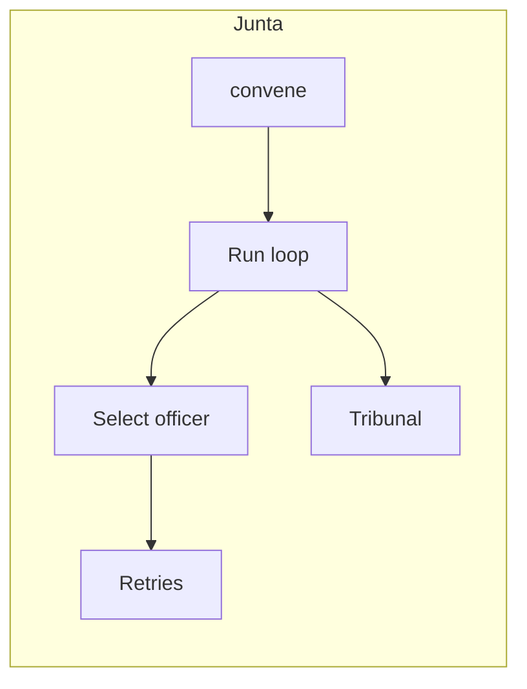

# Architecture

This page describes the generated structure of the `junta` package.

## Package layout

The generated project keeps reusable logic in `src/junta/`
and separates optional interfaces by feature flag.

## CLI

When CLI support is enabled, the Typer application lives in
`src/junta/cli/`.

- `main_cli.py` defines the root Typer app, global options, and context setup.
- `register.py` discovers command packages under `cli/commands/` and registers
  any Typer app exported as `app`.
- Command modules call into core logic in the package; Rich and Typer usage stay
  in the CLI layer.

## Configuration

Shared configuration is loaded through `Config()` in
`src/junta/config/`.

- `main_config.py` defines the common application settings.

## Execution kernel (`Junta`)

The **`Junta`** class in `src/junta/junta.py` is the top-level runtime: it registers **officers** (ordered),
optional **doctrine** (retries, failure policy, max steps, **tracer**), and an
optional **tribunal** for post-step review. A **mandate** plus optional **dossier**
are wrapped in an **operation** (`convene`), then **`execute`** runs the loop until
a terminal outcome, handoff, or limit.

Rich and Typer stay in **`junta/cli/`**; the kernel has no CLI dependencies.

Layout:

- `src/junta/junta.py` — `Junta`
- `src/junta/mandate/mandate.py` — `Mandate`, `Condition`
- `src/junta/dossier/dossier.py` — `Dossier`
- `src/junta/doctrine/doctrine.py` — `Doctrine`, `RetryPolicy`, `Tracer`
- `src/junta/operation/operation.py` — `Operation`
- `src/junta/operation/outcomes.py` — step and run results
- `src/junta/cabinet/officer.py` — `Officer` protocol
- `src/junta/tribunal/tribunal.py` — `Tribunal` protocol

Public imports are re-exported from `junta` (see `src/junta/__init__.py`).
